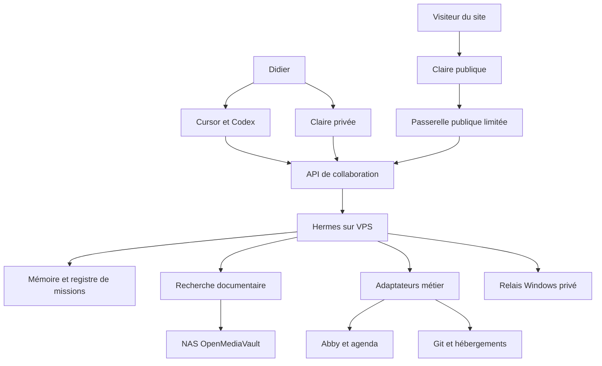
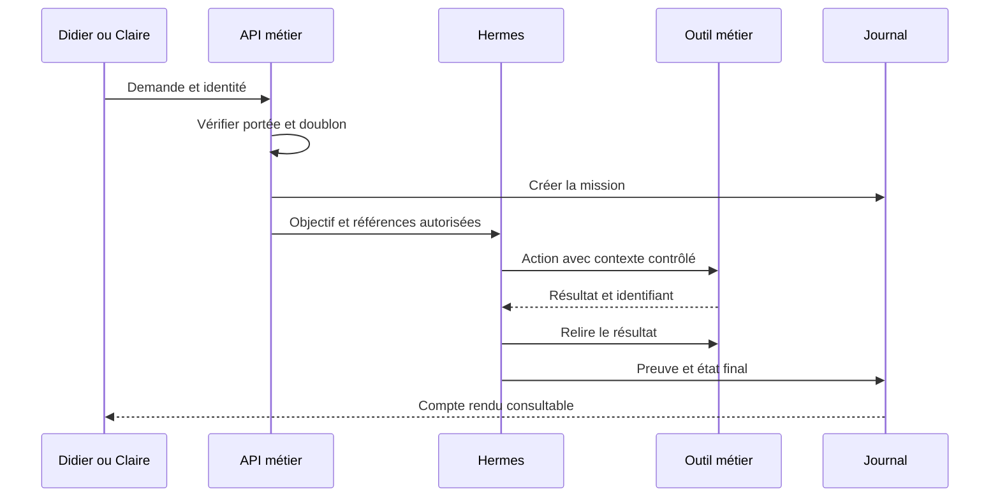

# 04 — Architecture générale et responsabilités

## Architecture cible

La cible associe un poste de travail local, un service de collaboration permanent sur VPS, un stockage documentaire sur NAS et des applications métier connectées. Les modèles IA sont appelés selon le fournisseur choisi. Le VPS exécute l'orchestration et les connecteurs ; il n'a pas besoin d'héberger un grand modèle local pour ce premier périmètre.

Ce diagramme décrit des responsabilités. Le nombre de boîtes ne prescrit pas autant de machines ni de conteneurs. Le premier déploiement peut réunir plusieurs services dans un même projet modulaire sur un VPS, avec des frontières logiques explicites.

## Composants à construire

| Composant proposé | Fonction | État persistant |
|---|---|---|
| `collaboration-api` | Réception des missions, identité, politiques et consultation des résultats | Référentiel métier et journal |
| `hermes-adapter` | Traduction d'une mission vers l'interface Hermes réellement disponible | Mapping mission/session, checkpoints |
| `job-runner` | Exécution, reprise, limites de concurrence et délais | États et tentatives des jobs |
| `knowledge-indexer` | Inventaire, extraction, indexation et actualisation | Sources, versions, fragments et index |
| `integration-adapters` | Abby, agenda, mail, Git et hébergement | IDs externes, curseurs et événements reçus |
| `pc-relay` | Exécution des commandes autorisées sur Windows | Capacités annoncées, journaux et résultat |
| `operations-ui` | Consultation des missions, décisions, coûts et incidents | Préférences d'affichage ; pas d'autorité concurrente |

Une interface HTTP Hermes native ne doit pas être supposée. Si la version retenue expose un protocole adapté, l'adaptateur l'utilise ; sinon l'implémentation devra encapsuler une interface prise en charge et vérifier les entrées, sorties, délais et annulations. Éviter de piloter une interface interactive par simulation de frappes pour une chaîne métier critique.

## Autorité de chaque donnée

| Donnée | Autorité | Copie utile dans la collaboration |
|---|---|---|
| Code | Git, commit identifié | Référence, rapport et statut de tests |
| Déploiement | Hébergeur | ID, URL, environnement, commit |
| Facture/devis | Abby | ID, version/état lu, synthèse et PDF archivé |
| Rendez-vous | Agenda principal | ID, horaire et liaison client/projet |
| Document original | NAS ou service cloud propriétaire | Métadonnées, empreinte et extrait indexé |
| Mission | Registre de collaboration | Référence vers toutes les preuves |
| Préférence de Didier | Profil professionnel corrigible | Source, date et portée |
| Secret | Stockage de secrets configuré | Référence opaque uniquement |

Un index n'est pas une nouvelle autorité sur une facture ou un contrat. Toute action engageante relit l'objet de référence. Un cache périmé peut aider à préparer un travail ; il ne permet pas d'affirmer un état courant.

## Séquence d'une mission

Pour une tâche longue, l'API répond rapidement avec `mission_id`. Le travail se poursuit côté service et les événements de progression sont consultables. Une fermeture de l'onglet Claire ou Cursor ne supprime pas la mission. Le redémarrage du processus relit les jobs persistés et leur dernier checkpoint.

## Identité et canaux

Claire publique reçoit une identité de session limitée au visiteur. Claire privée reçoit l'identité de Didier après authentification. Un client authentifié obtient un périmètre propre. Un message vocal disant « je suis Didier » n'est jamais une preuve d'identité. Les autorisations sont établies côté serveur avant d'appeler les outils.

L'identité de service du connecteur n'est pas celle du visiteur. Une connexion Abby avec des droits étendus doit être protégée par les capacités métier autorisées à l'acteur. Les champs `actor_id` ou `tenant_id` reçus du navigateur sont dérivés ou vérifiés par le serveur, jamais acceptés comme une autorisation autonome.

## Dégradation et disponibilité

| Incident | Ce qui peut continuer | Traitement attendu |
|---|---|---|
| PC éteint | Tâches cloud et NAS joignable | Mission locale en attente, expiration explicite |
| NAS indisponible | Documents déjà disponibles et sources cloud | Indiquer la date du cache ; différer la relecture indispensable |
| VPS indisponible | Site statique et navigation manuelle | Claire indique l'indisponibilité des actions métier |
| Fournisseur IA indisponible | Jobs déterministes et consultation des états | Repli uniquement vers un fournisseur configuré et autorisé |
| Abby indisponible | Préparation interne d'une proposition | Ne pas annoncer la création d'un document Abby |
| Session avatar expirée | Mission métier déjà créée | Reconnecter le dialogue à la même mission |

## Principes de simplicité

Pas de cluster Kubernetes au démarrage. Pas de second système de facturation. Pas de synchronisation bidirectionnelle générale de toutes les mémoires. Pas d'obligation de faire transiter l'audio temps réel par le VPS Hermes. Chaque service supplémentaire doit répondre à une contrainte constatée de charge, de disponibilité ou de développement.

Les définitions d'API et de données sont au chapitre 14. Le choix précis des bibliothèques, versions et images fait partie des premières décisions d'implémentation et doit être documenté dans un inventaire de dépendances.
