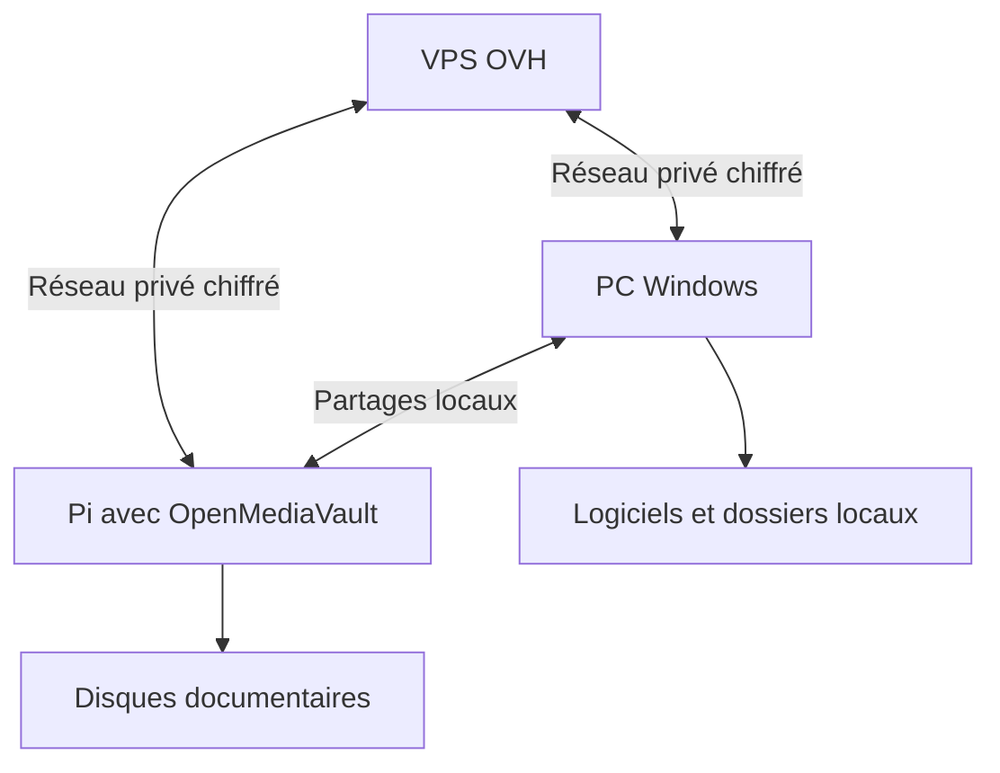

# 05 — Infrastructure VPS, PC Windows, NAS et réseau privé

## Implantation proposée

| Hôte | Rôle initial | Dimensionnement de départ |
|---|---|---|
| VPS OVH Linux | Hermes, API de collaboration, registre et recherche initiale | 8 Go conseillés pour la marge ; 4 Go envisageables pour un pilote limité |
| Raspberry Pi 4 + OMV | Documents, archives, sauvegardes et liaison privée | Matériel existant, RAM 4/8 Go à confirmer |
| PC Windows | Cursor, Codex et logiciels locaux | Inventaire réel avant installation du relais |
| Cloudflare | Site, routes applicatives publiques et contrôle d'accès adapté | Réutiliser le déploiement existant |
| Fournisseurs IA/médias | Inférence et génération | Services existants ou explicitement souscrits |

Ce dimensionnement est une hypothèse d'ingénierie. Il dépend de la concurrence, du volume documentaire, de l'OCR, du nombre de navigateurs et de la rétention. Le CPU du Pi ne change pas entre la version 4 et 8 Go. Une grande indexation ne doit pas être placée sur le NAS sans mesurer son impact sur le partage de fichiers.

## Réseau privé

Implémentation candidate : client Tailscale sur les hôtes compatibles ou passerelle locale toujours allumée. Une autre solution VPN est acceptable si elle satisfait l'identité des machines, la révocation, la restriction des accès et le fonctionnement sans le PC. Une passerelle de sous-réseau permet d'atteindre des équipements qui n'exécutent pas eux-mêmes le client, mais n'est pas nécessaire si seuls le PC et le NAS sont raccordés directement. [Documentation de routage privé Tailscale](https://tailscale.com/docs/features/subnet-routers/how-to/setup).

Le service documentaire du NAS passe par cette liaison privée. Le service HTTP public de Claire utilise une entrée distincte. Cloudflare Tunnel peut publier une application via un connecteur sortant ; l'authentification et la politique d'accès de l'application restent à configurer. Ce tunnel n'est pas à lui seul une autorisation d'accès. [Cloudflare Tunnel](https://developers.cloudflare.com/cloudflare-one/networks/connectors/cloudflare-tunnel/).

## VPS : organisation logique

Répertoires proposés, à adapter au mécanisme d'installation retenu :

| Emplacement logique | Contenu | Sauvegarde |
|---|---|---|
| Données Hermes | Profil principal, mémoire et sessions | Copie cohérente hors machine |
| Données métier | Missions, correspondances et événements | Export transactionnel + contrôle |
| Index documentaire | Métadonnées et index reconstruisible | Sauvegarde utile ; reconstruction documentée |
| Workspaces de code | Checkouts temporaires par mission | Git pour le code, artefacts conservés séparément |
| Journaux | Exploitation et preuves expurgées | Rotation et rétention définies |
| Secrets | Identifiants des connecteurs | Méthode dédiée, jamais Git ni mémoire libre |

Installer Hermes sous un utilisateur de service. Le service doit être supervisé, démarrer après reboot, avoir un dossier de données persistant et une limite de concurrence. Une session `ssh` maintenue ouverte n'est pas un dispositif d'exploitation. La documentation Hermes prévoit les installations Linux/ARM64 et les comptes non privilégiés ; les instructions exactes de la version retenue doivent être relues avant exécution. [Installation Hermes](https://hermes-agent.nousresearch.com/docs/getting-started/installation/).

## OpenMediaVault : raccordement documentaire

1. Relever version, architecture, mémoire, stockage, partages, utilisateurs et charge.
2. Identifier les dossiers de référence InfoServ2A sans réorganiser les originaux au premier passage.
3. Créer un compte de service documentaire avec les accès nécessaires aux dossiers retenus.
4. Choisir SMB pour les fichiers ou un mécanisme de transfert compatible. SSH est utile aux commandes d'inventaire ; il ne remplace pas la gestion des permissions du système de fichiers.
5. Tester lecture d'un fichier fictif, accès interdit à un dossier hors périmètre et écriture dans l'espace de travail prévu.
6. Tester l'accès depuis le VPS avec le PC éteint.
7. Prévoir une reprise après coupure et une date de dernière synchronisation.

Les permissions SMB et les permissions du système de fichiers doivent être cohérentes : autoriser l'écriture dans le partage ne suffit pas si le fichier l'interdit. [Permissions OpenMediaVault](https://docs.openmediavault.org/en/stable/administration/services/samba.html).

L'indexeur énumère les chemins explicitement autorisés, limite son débit et conserve un checkpoint. Les archives volumineuses sont traitées en lot. Les vidéos ne sont pas transcrites automatiquement en masse : commencer par leurs métadonnées et les documents associés, puis enrichir selon la valeur métier.

## Windows : relais d'exécution

OpenSSH Windows permet les commandes distantes. Le choix du shell, les chemins contenant des espaces, l'encodage et les droits de l'utilisateur doivent être testés. [OpenSSH Windows](https://learn.microsoft.com/en-us/windows-server/administration/openssh/openssh_install_firstuse).

Le relais proposé publie un inventaire de capacités : lecture de dossiers, lancement de tests, exports d'application, exécution de scripts nommés. Une commande est décrite par des paramètres validés ; éviter de construire une ligne PowerShell en concaténant une phrase utilisateur. Les opérations longues rendent un ID puis un résultat. Le relais refuse les missions expirées ou déjà exécutées.

Un service Windows peut ne pas voir les lecteurs réseau mappés dans la session de Didier. Utiliser des chemins accessibles à son identité d'exécution, tester les chemins UNC et éviter de supposer que `Z:` ou OneDrive existe pour tous les comptes.

Le contrôle du bureau est un lot séparé : session interactive, capture, moteur de contrôle compatible, comportement écran verrouillé, absence de session et perte de focus. Le système annonce `desktop_unavailable` si le bureau n'est pas pilotable. Il ne contourne pas le verrouillage.

## OneDrive

OneDrive assure la synchronisation de fichiers. Il ne transporte pas les commandes et ne donne pas la maîtrise de Windows. Les fichiers à la demande doivent être réellement téléchargés avant lecture par un outil local. Un autre chemin possible est l'API du service cloud, avec son authentification propre.

Les bases actives de Hermes et des jobs restent sur un disque local à leur serveur. Les sauvegardes sont exportées proprement vers le NAS. Éviter de faire écrire plusieurs processus dans une base active placée sur un partage synchronisé. Les dépôts de développement gagnent à avoir un emplacement dédié, avec Git comme mécanisme de versionnement et des exports documentaires vers OneDrive lorsque nécessaire.

## Option ultérieure : Hermes sur le Pi

Possible à étudier si le système est ARM64 et si l'exploitation est légère avec modèles distants. Critères : mémoire disponible, temps de réponse du NAS, stabilité du stockage, température, sauvegarde et comportement sous charge. La décision peut être révisée après un pilote. Le présent dossier retient le VPS pour donner de la marge au traitement documentaire et préserver la disponibilité du NAS.
