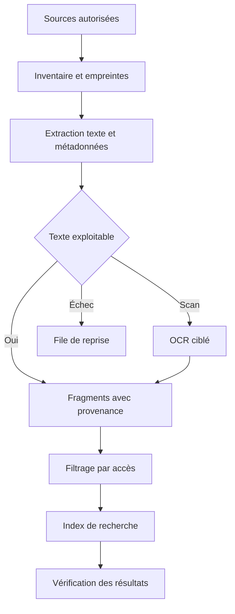

# 06 — Mémoire persistante, documentation et apprentissage

## Six niveaux de connaissance

| Niveau | Contenu | Usage | Actualisation |
|---|---|---|---|
| Profil professionnel | Préférences, conventions, attentes de Didier | Adapter la collaboration | Corrections explicites et observations sourcées |
| Mémoire durable | Décisions stables et repères importants | Reprendre une session | Consolidation contrôlée par Hermes |
| Historique | Conversations et missions passées | Retrouver un échange précis | À chaque mission ou conversation |
| Dossier projet | Objectifs, version, décisions, risques, prochains travaux | Travailler sur un projet identifié | Après chaque changement significatif |
| Fonds documentaire | Documents NAS, cloud et Git | Retrouver les preuves et les détails | Indexation incrémentale |
| Procédures | Méthodes testées, variantes et erreurs connues | Reproduire un travail | Après validation d'un retour d'expérience |

Hermes documente une mémoire synthétique persistante, un profil utilisateur et une recherche dans ses sessions. Les limites configurables par défaut indiquées lors de la vérification sont de 2 200 caractères pour `MEMORY.md` et 1 375 pour `USER.md`. Ce n'est donc pas un stockage exhaustif des archives. La documentation déconseille deux processus écrivant dans le même répertoire Hermes. [Mémoire Hermes](https://hermes-agent.nousresearch.com/docs/user-guide/features/memory).

L'architecture proposée conserve un propriétaire de cette mémoire et ajoute un catalogue documentaire. La base documentaire n'est pas injectée intégralement à chaque conversation : les passages pertinents sont recherchés puis relus selon la mission.

## Modèle d'une source documentaire

Champs nécessaires : `source_id`, type de source, identifiant externe ou chemin, client/espace, projet, propriétaire, droits de lecture, nom, MIME, taille, empreinte, date de modification, version, date d'indexation, état d'extraction, classification et lien vers l'original.

Le nom seul est insuffisant. Deux fichiers `devis-final.pdf` peuvent appartenir à deux clients ou à deux périodes. L'identité est composée du connecteur et de l'identifiant stable de l'objet ; l'empreinte détecte les doublons de contenu. Une copie identique dans OneDrive et sur le NAS garde ses emplacements et sa provenance.

## Chaîne d'indexation proposée

1. Parcourir les sources par lots bornés. Enregistrer le checkpoint avant le lot suivant.
2. Exclure les secrets, fichiers temporaires et formats non nécessaires à la mission d'indexation.
3. Dédupliquer les contenus sans effacer les fichiers d'origine.
4. Extraire le texte en conservant pages, sections et structure tabulaire utile.
5. Pour les scans, appliquer l'OCR avec un score de confiance. Une extraction incertaine de montant ou d'identité déclenche une vérification sur la pièce.
6. Découper en fragments qui restent reliés au document entier. Conserver les titres parents.
7. Indexer d'abord les mots et les métadonnées ; ajouter la recherche sémantique si les tests montrent un besoin.
8. Tester des questions de référence avec réponse attendue et document exact.

Le choix PostgreSQL/FTS, SQLite/FTS ou moteur spécialisé dépend de la concurrence et du volume observés. Il faut éviter de multiplier les bases avant mesure. La recherche vectorielle seule peut retrouver un contenu proche mais erroné ; combiner identifiants, mots exacts, dates et rapprochement sémantique lorsque nécessaire.

## Recherche au moment d'une mission

Le système commence par identifier client et projet. Les restrictions d'accès s'appliquent avant de présenter les résultats au modèle. Il cherche ensuite dans les sources autorisées, compare les versions et cite le document utilisé. Un contrat signé prime sur une ancienne proposition pour les engagements ; un statut de paiement est relu dans l'application comptable.

La réponse conserve `source_id`, version, passage et date de lecture. Si aucune preuve suffisante n'existe, le système le dit et demande la donnée manquante. Il ne comble pas un montant, une adresse ou une décision client par une estimation non signalée.

## Fraîcheur et changements

Détecter les ajouts, modifications, déplacements et suppressions. Une suppression retire le contenu des résultats selon la politique applicable, en laissant une trace minimale d'audit si nécessaire. Un changement de permissions invalide immédiatement l'accès dans les résultats, même si le texte est encore physiquement dans l'index.

Les webhooks sont utilisés lorsqu'ils sont disponibles et fiables. Sinon, une collecte incrémentale périodique avec chevauchement et déduplication convient. Après expiration d'un curseur, relancer un inventaire borné plutôt que prétendre que l'index est complet.

## Apprendre la façon de travailler de Didier

Le cycle proposé : une mission est réalisée, Didier corrige ce qui compte, le résultat corrigé est conservé, puis une procédure candidate est extraite. La procédure décrit les préconditions, étapes, critères de réussite, exceptions et outils nécessaires. Elle référence les missions qui l'ont éprouvée. Un succès isolé ne justifie pas de généraliser une règle à tous les clients.

Les skills Hermes servent de supports de procédures. Ils doivent être versionnés, relus après une modification d'outil et évalués sur un exemple représentatif. La création d'une procédure à partir de l'expérience ne correspond pas à un réentraînement des poids du modèle. [Skills Hermes](https://hermes-agent.nousresearch.com/docs/user-guide/features/skills).

Exemple : « livrer un site vitrine » peut devenir une procédure ; les mots de passe, préférences privées d'un client et particularités d'un hébergeur restent des données du projet. Cette séparation permet la réutilisation sans fuite entre clients.

## Mémoire partagée avec Cursor et Codex

Les outils lisent la fiche projet et le rapport précédent. Ils transmettent des observations structurées : fait, preuve, date, portée et niveau de confiance. Hermes peut les intégrer à la mémoire ou au dossier. Ils ne réécrivent pas directement les fichiers de mémoire pendant qu'Hermes tourne.

Une correction de Didier est enregistrée avec un lien vers l'élément remplacé. Le système doit pouvoir répondre « qu'as-tu retenu sur ce projet ? » et permettre la modification ou l'oubli. Les données de personnes et les documents métier suivent des règles de conservation définies par catégorie, à valider dans le contexte réel.

## Données et fournisseurs IA

Conserver les documents sur le NAS n'empêche pas l'envoi d'extraits au fournisseur IA lorsqu'une mission les utilise. Définir quelles catégories peuvent sortir, quel fournisseur est permis et quelle quantité de contexte est nécessaire. Une option de traitement local ne sera présentée comme telle que si toute sa chaîne, y compris extraction, indexation et raisonnement, a été vérifiée.

## Recette spécifique

Questions témoins : retrouver le dernier devis d'un client fictif ; distinguer devis et facture ; identifier la décision technique en vigueur ; retrouver une correction de Didier ; refuser un document d'un autre client ; signaler qu'une source NAS n'est pas accessible ; mettre à jour une réponse après modification de la source ; oublier un fait retiré. Les preuves comprennent les résultats, versions, dates et contrôles d'accès.
