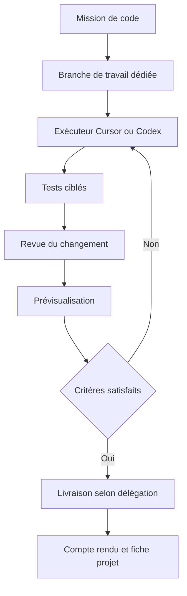

# 07 — Cursor et Codex dans la collaboration

## Poste principal

Cursor est le point d'entrée de Didier pour développer, examiner les fichiers, lancer les vérifications et suivre les missions. Il peut ouvrir les dépôts locaux et utiliser SSH pour travailler sur le VPS. Son agent reçoit un dossier de mission précis ; il n'a pas besoin de relire toute la documentation de l'entreprise pour chaque correction.

Le MCP relie Cursor à des outils externes. La configuration peut être globale ou propre à un projet. L'exemple d'annexe contient seulement les URL publiques documentées d'OVH et Abby ; il doit être fusionné avec la configuration existante et authentifié. [Configuration MCP Cursor](https://cursor.com/docs/mcp).

## Intégration initiale de Hermes

Deux niveaux sont prévus. D'abord, Cursor lit les documents et travaille via SSH sur l'installation Hermes. Ensuite, un MCP interne de collaboration peut exposer la recherche des projets, la création d'une mission et la consultation des preuves. Ce MCP interne est à développer selon le contrat du chapitre 14. La présence de Hermes sur le VPS ne l'ajoute pas automatiquement aux outils de Cursor.

Les connexions configurées dans Cursor ne sont pas automatiquement disponibles pour Hermes ou Codex. Chaque client possède son contexte d'exécution et ses authentifications ; utiliser une procédure de connexion propre à chaque surface ou un service métier partagé avec identité de l'appelant.

## Place de Codex

Codex prend des missions de programmation : diagnostic, implémentation, tests, revue et documentation. Sa documentation décrit des capacités MCP et une exécution non interactive. Une intégration par CLI pourra utiliser les options prises en charge par la version installée, après vérification locale de l'aide et d'un scénario pilote. [MCP Codex](https://developers.openai.com/codex/mcp/), [Mode non interactif](https://developers.openai.com/codex/noninteractive/).

Un abonnement de développement et les appels d'API constituent des modes d'accès distincts. Le dossier ne présume ni qu'ils sont interchangeables ni qu'un abonnement de Cursor finance les appels Hermes. L'inventaire indique pour chaque exécuteur : produit, authentification, modèle accessible, quota et source de coût.

## Fiche de mission de code

| Champ | Exigence |
|---|---|
| Dépôt et référence | URL autorisée, branche de base et SHA |
| Problème | Comportement observé, impact utilisateur, reproduction |
| Résultat attendu | Critères métier et techniques précis |
| Périmètre | Fichiers ou composants à examiner ; dépendances connues |
| Contraintes | Visuels validés, compatibilité S22, hébergeur et budget |
| Vérifications | Commandes et scénarios pertinents |
| Sortie | Commit/PR, résultats et anomalies restantes |
| Autorisation | Catégorie d'action et délégation applicable |

## Coordination des modifications

Si plusieurs agents interviennent, leurs tâches ont des frontières explicites et des worktrees séparés. Le coordonnateur résout les conflits, revoit la combinaison et exécute les tests pertinents après intégration. Les agents ne poussent pas simultanément sur une branche commune.

Une revue doit rechercher les erreurs métier, les régressions, les données exposées et la cohérence des tests. Éviter les tests qui ne font que répéter le texte de l'implémentation. Pour une modification documentaire, les liens et exemples sont vérifiés ; une recette audio réelle n'est pas annoncée pour ce motif.

## Reprise de l'existant Claire

Le dépôt courant est essentiellement HTML/CSS/JS avec Worker. Ne pas imposer Next.js ou un autre framework sans besoin démontré. La branche `main` est décrite comme reliée à la production Cloudflare. Conserver les commandes de test existantes, identifier l'environnement cible et vérifier le SHA déployé après une livraison.

Le travail de généralisation doit extraire un contrat commun d'actions et des adaptateurs ; il ne doit pas écraser les particularités de PocketGuide ou des sites clients. Le produit générique et chaque instance client ont un versionnement et des tests de compatibilité.

## Définition du résultat

Le rapport indique : problème résolu, comportement obtenu, fichiers modifiés, commit, tests exécutés avec résultat, URL de prévisualisation si créée, risques restants et marche arrière. Une commande réussie n'est pas suffisante si le navigateur rend encore une ancienne version. Une annonce de déploiement est accompagnée d'un identifiant fournisseur et d'un contrôle de l'URL concernée.

## Routines proposées

En début de mission : lire la fiche projet et le dernier rapport. Pendant : mettre à jour l'état et les blocages. À la fin : enregistrer les preuves et proposer une amélioration de procédure si elle est réutilisable. Les routines programmées de maintenance doivent utiliser un calendrier et une file de jobs persistants ; un onglet Cursor laissé ouvert n'est pas le mécanisme de planification.
