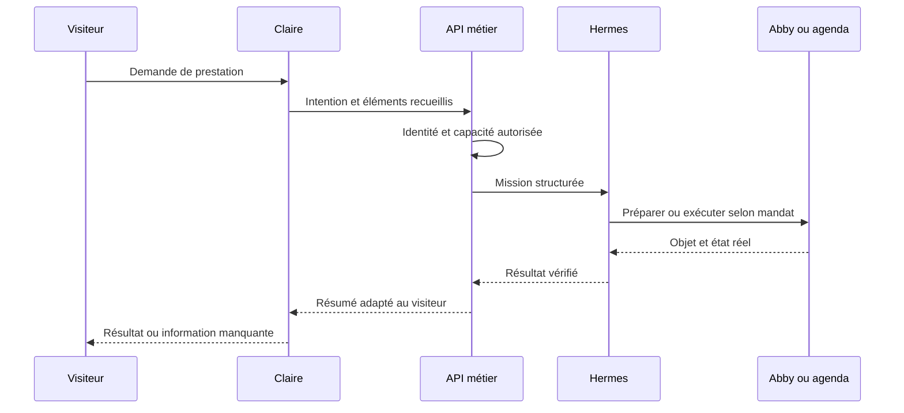

# 08 — Claire, interface de collaboration vocale et visuelle

## Rôle et continuité

Claire accueille, comprend les demandes, aide à naviguer, propose les prochaines étapes et restitue les résultats de Hermes. Elle doit pouvoir accompagner Didier dans l'espace privé et les visiteurs sur le site, avec des accès différents. Le même visage ou la même voix ne signifie pas une mémoire commune accessible à tous.

| Mode | Identité | Données consultables | Actions cibles |
|---|---|---|---|
| Public | Session visiteur | Catalogue public et informations publiées | Expliquer, qualifier, préparer une demande |
| Client connecté | Compte client vérifié | Dossier et objets autorisés de ce client | Suivre une demande, choisir un créneau, consulter ses documents |
| Privé Didier | Authentification professionnelle | Périmètre entreprise autorisé | Créer/suivre les missions, consulter les projets, déléguer |

Le choix du mode est imposé par le serveur. Une instruction prononcée dans une session publique ne peut pas ouvrir le NAS ni changer l'acteur.

## Base existante à préserver

Le dépôt contient un contrôleur Claire, un adaptateur de site, un manifeste de capacités, des fonctions de session LiveAvatar et des tests. Le fichier de session lu utilise un mode LITE avec configuration OpenAI Realtime côté serveur. Les évolutions métier devront être raccordées à cette base après audit des événements et du transport réellement exposés.

Principe de reprise proposé : préserver la présence et la disposition actuelles de Claire pendant la greffe métier. La transformer en bulle de support relève d'un changement produit distinct. Les comportements sur mobile, tablette et PC sont repris depuis l'état courant du dépôt, puis testés sur les appareils cibles. Le S22 est notamment mentionné dans la documentation existante. Une évolution de la disposition doit être traitée comme une décision produit explicite.

## Trois flux distincts

1. **Média** : microphone, audio, vidéo avatar et synchronisation.
2. **Conversation** : transcription utile, intention, contexte de session et réponse.
3. **Action métier** : appel contrôlé à une capacité, suivi de mission et preuve de résultat.

Le flux média ne doit pas attendre la fin d'un traitement documentaire de plusieurs minutes. Claire peut annoncer qu'une mission démarre puis restituer son résultat lorsqu'il est confirmé. Les tâches longues sont corrélées par identifiants, pas par la durée d'une session vidéo.

## Catalogue initial des actions

Les noms suivants décrivent les intentions de l'interface proposées. Ils ne sont pas présentés comme outils LiveAvatar ou Hermes existants. Une traduction les relie aux capacités serveur de l'annexe ; la navigation locale reste une responsabilité du contrôleur du site.

| Capacité | Public | Client | Didier |
|---|---|---|---|
| `service.explain` | Oui | Oui | Oui |
| `site.navigate` | Oui | Oui | Oui |
| `request.prepare` | Oui | Oui | Oui |
| `appointment.suggest` | Créneaux publiables | Selon son dossier | Selon l'agenda |
| `appointment.book` | Après étape de confirmation et identité suffisante | Selon délégation | Selon délégation |
| `estimate.prepare` | Demande structurée seulement | Selon dossier | Brouillon métier |
| `project.status` | Non | Son projet | Ensemble autorisé |
| `knowledge.search` | Corpus public | Corpus client | Corpus entreprise autorisé |
| `mission.create` | Types publics bornés | Types client bornés | Types professionnels autorisés |
| `pc.execute` | Non | Non | Selon capacité et contexte local |

Correspondances de départ : `appointment.suggest` vers `calendar.slots.propose`, `appointment.book` vers `calendar.booking.create`, `knowledge.search` public vers `knowledge.public.search`, et `pc.execute` vers une capacité locale précise telle que `pc.command.test`. L'intention `estimate.prepare` d'un visiteur produit une demande à qualifier ; elle n'accorde pas l'accès direct à `abby.estimate.prepare`. `project.status` combine les lectures de projet et de mission autorisées. Le catalogue serveur reste l'autorité sur ce qui est réellement exécutable.

## Contrat d'une action vocale

Entrée : `session_id`, capacité, arguments validés, identifiant de tour et clé de déduplication. L'identité est déduite du contexte serveur. Sortie : `accepted`, `needs_information`, `awaiting_decision`, `running`, `completed`, `failed` ou `unavailable`, avec un message adapté et un identifiant de preuve si pertinent.

Claire ne dit pas « envoyé » après la simple préparation d'un email. Elle distingue « le devis est préparé », « le devis est finalisé » et « l'envoi a été accepté par le fournisseur ». La réception effective par le destinataire peut demander une information supplémentaire du service de messagerie.

Si le client interrompt Claire, l'audio peut être coupé sans annuler une facture ou un rendez-vous déjà créé. L'annulation d'une mission est une action métier distincte qui vérifie l'état et les possibilités de compensation.

## Choix du transport

Conserver d'abord le transport existant et mesurer. Si l'intégration actuelle ne permet pas les outils métier nécessaires, réaliser un prototype isolé de l'adaptateur avant migration. LiveAvatar distingue plusieurs modes et propose une documentation d'intégration. LiveKit peut orchestrer des participants voix/vidéo, mais ne fournit pas à lui seul les règles de facturation, la mémoire d'entreprise ou les autorisations PC. [LiveAvatar](https://docs.liveavatar.com/docs/agent-skills), [LiveKit Agents](https://docs.livekit.io/agents/).

Pour une connexion directe OpenAI Realtime depuis le navigateur, utiliser le mécanisme de session et de jetons temporaires prévu par la documentation, avec la clé durable conservée côté serveur. Ce choix serait une variante de l'architecture existante, pas une étape obligatoire de cette livraison documentaire. [Realtime WebRTC](https://developers.openai.com/api/docs/guides/realtime-webrtc).

## État de session

États proposés : `initializing`, `ready`, `listening`, `processing`, `speaking`, `reconnecting`, `expired`, `manual`. Les transitions doivent empêcher les doubles accueils, les doubles requêtes et les oscillations de scène. Le contrôleur de l'application reste l'autorité sur la page courante et l'action accomplie.

La durée maximale est lue/configurée selon la session et l'offre effective. À expiration, conserver le contexte métier minimal et permettre une reprise. Ne pas prolonger une session au-delà du mécanisme fournisseur. Si l'avatar devient indisponible, afficher clairement les options réellement disponibles ; ne pas remplacer silencieusement la voix validée.

## Mesures et recette

Mesurer séparément initialisation, première réponse audible, durée d'appel outil et synchronisation audio/vidéo. Définir les objectifs après une référence sur S22 et PC. Essais requis : session réelle supérieure à une minute, interruption, passage à un formulaire, navigation, rotation d'écran, retour d'arrière-plan, expiration, panne du VPS et résultat métier long.

Une démonstration enregistrée et les journaux expurgés permettent de vérifier l'enchaînement. Les tests simulés sont utiles au contrôleur ; ils ne remplacent pas une recette microphone/haut-parleur sur le téléphone réel.
