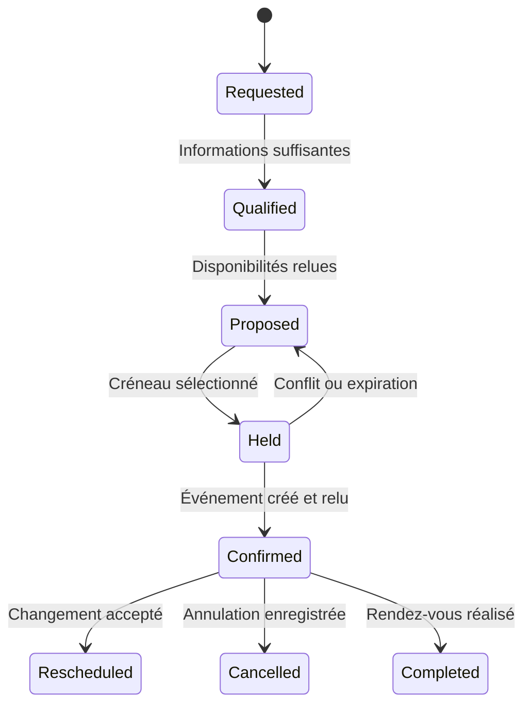

# 09 — Clients, agenda et communications

## Référentiel relation client

Le système distingue une personne, une organisation, un site d'intervention, un projet et un interlocuteur de facturation. Une même personne peut intervenir pour plusieurs organisations. Un changement d'adresse email ne crée pas automatiquement un nouveau client. Les liens avec Abby sont conservés par identifiant externe.

Une fiche client contient les coordonnées utiles, les canaux convenus, les projets, les contrats, les équipements, les rendez-vous et les documents accessibles. Les notes techniques d'un réseau et les conditions commerciales internes ne sont pas visibles dans l'espace client par simple appartenance à la même fiche.

États proposés d'une opportunité : `new`, `qualified`, `proposal_prepared`, `proposal_sent`, `accepted`, `refused`, `on_hold`, `closed`. Ces états sont internes et reliés aux objets externes. Une facture réglée n'implique pas que toutes les tâches d'un projet sont terminées.

## Accueil et qualification

Claire recueille progressivement : nature du besoin, situation actuelle, résultat souhaité, localisation si intervention, contraintes de délai, coordonnées et moyen de réponse. Elle n'impose pas un long formulaire initial. Elle reformule les points essentiels et distingue les réponses du client des hypothèses techniques.

Exemple réseau : « Wi-Fi insuffisant » est précisé par les zones, le nombre d'usagers, les équipements et les difficultés observées. Exemple site : demander objectifs, langues, contenus disponibles et échéance. Exemple logiciel : demander les opérations à accomplir et qui les effectuera. Les informations inconnues deviennent des questions de diagnostic, pas des valeurs inventées.

La demande originale est conservée, avec sa synthèse et ses pièces. L'attachement au client est vérifié par identifiant ou rapprochement explicite. L'email seul peut être partagé ou mal saisi ; prévoir les cas ambigus.

## Agenda : source principale

Choisir Google Calendar, Microsoft 365 ou un autre agenda réel après inventaire. Ne pas maintenir deux calendriers maîtres en synchronisation bidirectionnelle improvisée. L'adaptateur doit pouvoir lire les disponibilités, créer, relire, déplacer et annuler un événement, et traiter la réauthentification.

Google Calendar documente une API de disponibilités sur une période et un ensemble de calendriers. Cette lecture donne les plages occupées ; la logique de durée, déplacement, horaires et confirmation reste à construire dans le projet. [API FreeBusy](https://developers.google.com/workspace/calendar/api/v3/reference/freebusy/query).

## Règles de disponibilité proposées

Paramètres privés à renseigner : fuseau `Europe/Paris`, horaires ouvrés, congés, durées par type de rendez-vous, temps de préparation, déplacement, zones géographiques, délai minimal, capacité quotidienne et modalités d'urgence. Stocker les instants en UTC et conserver le fuseau métier pour l'affichage et les récurrences.

Un créneau libre de trente minutes ne convient pas à une intervention d'une heure avec déplacement. Les horaires énoncés à la voix sont reformulés avec date complète et lieu. Les changements d'heure sont couverts par des tests ; éviter de stocker seulement un décalage `+02:00` valable en été.

## Parcours de réservation

La réservation locale provisoire a une durée courte et expire si le dialogue s'interrompt. Avant création, relire l'agenda et verrouiller la réservation dans l'application. Utiliser un identifiant de demande unique pour empêcher un double envoi. Après création, relire l'objet fournisseur et conserver son ID. Un verrou local ne bloque pas les modifications manuelles externes : une détection de conflit après création doit permettre une correction expliquée.

Si la création expire sans réponse, vérifier si l'événement existe avant de réessayer. Un rappel ne crée pas un nouveau rendez-vous. Un déplacement actualise l'objet identifié, son historique et les notifications applicables. Une annulation cliente ne supprime pas le dossier du projet.

## Communications

Trois classes : préparation de message, émission autorisée, suivi de livraison. L'interface doit montrer le canal, l'identité d'expéditeur, le destinataire, l'objet, les pièces et la mission associée. Une délégation permanente peut couvrir des confirmations de rendez-vous selon un modèle ; elle doit préciser le périmètre et la révocation. Le système suit les mandats déjà établis sans redemander chaque routine.

Pour les emails, inventorier le fournisseur réel et les interfaces prises en charge. Le site possède une route d'envoi ; son existence ne constitue pas une messagerie complète avec réception, fils de discussion et classement. Construire ou raccorder ces fonctions séparément si elles sont nécessaires.

Prévoir pièces trop volumineuses, adresse invalide, rebond, doublon de destinataire, alias et absence d'autorisation. Une pièce de devis doit appartenir au même client que le destinataire. Un lien temporaire n'est pas un archivage durable.

## Routines métier

| Routine proposée | Déclencheur | Résultat |
|---|---|---|
| Préparer la journée | Horaire choisi par Didier | Rendez-vous, trajets, pièces et matériel nécessaires |
| Confirmer un rendez-vous | Événement créé et relu | Message selon le canal convenu |
| Préparer une intervention | Rendez-vous approchant | Historique, diagnostic préalable et liste de contrôle |
| Relancer une proposition | Délai contractuel et absence de réponse | Brouillon ou envoi selon délégation |
| Mettre à jour le dossier | Retour d'intervention | Compte rendu, pièces et prochaine action |
| Détecter une demande oubliée | État sans activité depuis le délai défini | Tâche priorisée sans multiplier les rappels |

Ces routines sont à implémenter dans le service ; elles ne sont pas activées par la publication de la documentation.

## Recette

Tester deux demandes simultanées sur le même créneau, une modification manuelle de l'agenda, une réponse API perdue après création, une session Claire expirée, une heure d'hiver/été et une adresse incorrecte. Vérifier un événement unique, la correspondance au client et l'absence d'annonce prématurée de confirmation.
