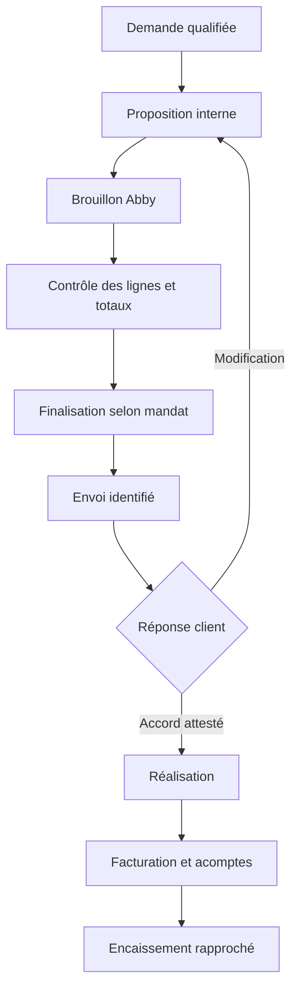

# 10 — Abby, devis, facturation et suivi comptable

## Portée

La cible couvre la préparation commerciale, les devis, acomptes, factures, avoirs, justificatifs, encaissements, suivi des dépenses et préparation des déclarations. Abby reste la source de référence pour les objets qu'il gère. Le système de collaboration relie ces objets aux missions et aux documents, sans inventer une deuxième comptabilité.

Le nom Abby est l'interprétation de « Abi/ABI » retenue dans ce dossier, à confirmer pendant L0. La connexion actuelle de Didier et un éventuel besoin de reprise d'historique ne sont pas vérifiés ici. L0 devra établir ce qui existe réellement : compte, paramètres de l'entreprise, historiques disponibles, catalogue, clients et pièces. Les statuts fiscaux, taux, échéances et mentions sont des paramètres à vérifier dans les outils et auprès des sources applicables au moment de l'implémentation.

## Capacité confirmée par la documentation

Abby publie un MCP distant à `https://api.abby.fr/mcp`, avec authentification OAuth et transport StreamableHTTP. La connexion doit être effectuée dans chaque environnement qui l'utilise. [Démarrage MCP Abby](https://docs.abby.fr/mcp/demarrer).

La documentation de facturation expose notamment `get-customers`, `create-estimate`, `create-invoice`, `finalize-billing` et `download-billing-document`. La création produit un brouillon ; la finalisation attribue un numéro et rend le document non modifiable. `update-billing-lines` remplace l'ensemble des lignes. `send-invoice-by-email` est distinct de la finalisation. `sign-estimate` modifie un statut ; son appel ne constitue pas à lui seul une preuve que le client a donné son accord. [Facturation Abby](https://docs.abby.fr/mcp/facturation).

Les montants API sont en centimes. Les codes TVA et scopes sont explicites. Utiliser une arithmétique décimale ou des entiers adaptés, jamais une conversion flottante approximative. Le code TVA doit être déterminé selon la situation réelle ; ne pas conserver une valeur par défaut par oubli. [Conventions Abby](https://docs.abby.fr/mcp/conventions.md).

## Catalogue commercial

Chaque ligne de service possède une référence, une désignation, une unité, un prix, une version, une date de validité, une règle de taxe, un périmètre inclus et les dépassements éventuels. Le catalogue privé doit intégrer prestations web, logiciel, réseau, vidéosurveillance, assistance, maintenance récurrente, formation et déplacement selon les offres réelles.

Hermes peut proposer la combinaison de services, mais le calcul utilise les règles du catalogue. Un devis au forfait conserve ses hypothèses et exclusions. Un devis à l'heure distingue estimation, plafond et réalisé. Les frais de déplacement restent séparés afin de ne pas les appliquer deux fois.

## De la demande au devis

1. Identifier la demande, le client facturable et le projet.
2. Rechercher les documents et décisions utiles ; conserver leurs références.
3. Déterminer les lignes de service et les quantités ; marquer les hypothèses.
4. Calculer les totaux et contrôler unités, devise, taxes et remises.
5. Créer une proposition interne datée, puis un brouillon Abby selon la mission autorisée.
6. Relire les lignes et totaux du brouillon réel ; comparer aux valeurs attendues.
7. Appliquer la politique de finalisation/envoi configurée ; conserver la preuve de cette autorisation.
8. Archiver le document produit et enregistrer son identifiant dans le projet.

Les dialogues ambigus sur le budget produisent une demande de précision. Un montant final n'est pas déduit d'une phrase vague telle que « comme la dernière fois » sans retrouver le document et vérifier son applicabilité.

## États et transitions

La machine à états interne est reliée aux états Abby mais ne les remplace pas. Une acceptation verbale rapportée est une information à qualifier ; une signature ou confirmation externe est conservée comme preuve. Le système ne marque pas un devis accepté simplement pour débloquer sa propre chaîne.

## Facturation et contrôle des paiements

Déterminer ce qui a été livré et les montants déjà facturés. Rapprocher les acomptes et éviter une double facturation du même poste. Contrôler le client, la devise, les références du devis et les échéances. Après finalisation, relire l'état du fournisseur et archiver le document final.

Le marquage « payé » doit provenir d'une donnée bancaire, d'un événement fiable du fournisseur ou d'une saisie humaine justifiée. Le système ne simule pas un encaissement pour terminer une mission. Un paiement partiel garde un solde et une date de rapprochement. Les frais bancaires et remboursements sont traités séparément selon les capacités vérifiées.

## Prévenir les doublons

La clé de commande interne combine l'opération métier, la demande et la version de la proposition. Elle est enregistrée avant l'appel externe. Si la requête expire, rechercher le document créé et rapprocher les références avant toute nouvelle création. L'absence d'une garantie d'idempotence dans un outil doit être compensée par le registre interne et une procédure de réconciliation, pas par une boucle de retry aveugle.

## Dépenses et anciens historiques

La présence du MCP de facturation ne prouve pas un accès complet aux achats, banques et imports. Construire une matrice réelle à partir des outils découverts sur le compte. Pour une fonction absente : API documentée si disponible, import/export pris en charge, ou procédure manuelle assistée. Les routes et noms d'outils non établis ne doivent pas être inventés.

Pour une migration : conserver l'export original, inventorier les pièces, compter les lignes, rapprocher les totaux par période, identifier les doublons, conserver les anciens identifiants et produire un rapport d'écarts. Importer un échantillon représentatif avant les lots complets. Une migration est terminée lorsque les totaux et les documents sont rapprochés, pas lorsque le bouton d'import a répondu.

## Déclarations et clôture de période

Les états préparatoires distinguent chiffre d'affaires, encaissements, dépenses, catégories et périodes selon la situation applicable. Aucun taux de cotisation ou calendrier réglementaire n'est fixé dans ce dossier. Un connecteur de déclaration doit être vérifié sur le compte, avec son périmètre exact et sa preuve de transmission.

La routine mensuelle proposée rassemble les pièces manquantes, factures ouvertes, paiements non rapprochés, dépenses à classer et anomalies. Elle produit un dossier de contrôle lisible par Didier et, le cas échéant, son conseil. Une transmission officielle reçoit un accusé conservé ; un tableau préparatoire n'est pas une déclaration transmise.

## Exemple fictif de contrôle

Deux heures à 50,00 EUR et une prestation à 25,00 EUR donnent 125,00 EUR avant traitement de taxe applicable. L'API reçoit des prix unitaires de 5000 et 2500 centimes. Le test doit comparer les lignes, la quantité, la remise, les arrondis et les totaux renvoyés. Ces chiffres sont uniquement des données de test, pas les tarifs d'InfoServ2A.

## Recette minimale

Client homonyme ; montant avec centimes ; quantité fractionnaire ; taxe absente ; double clic ; timeout après création ; document déjà finalisé ; acompte ; paiement partiel ; demande d'avoir ; pièce jointe du mauvais client ; token expiré ; champ OCR erroné. Chaque test utilise des objets fictifs ou un environnement explicitement prévu à cet effet.
