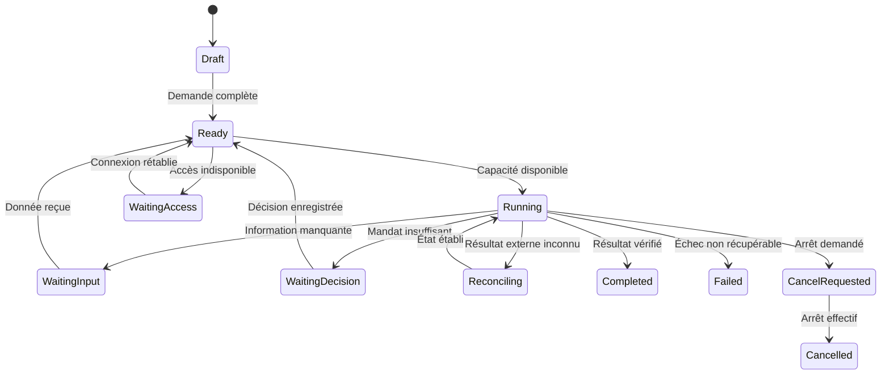

# 14 — Contrats proposés et modèle de données

## Statut des interfaces

Toutes les routes et capacités de ce chapitre sont des **interfaces internes à implémenter**. Elles ne sont pas des endpoints natifs garantis de Hermes ou des fournisseurs. Les adaptateurs traduisent ces contrats vers les interfaces réellement disponibles, avec leurs authentifications et limites.

Le but est de découpler le dialogue, la planification et les opérations métier. Une nouvelle interface Claire ou une nouvelle version de Cursor doit pouvoir appeler les mêmes missions sans réimplémenter les règles de devis et de réservation.

## Objets principaux

| Objet | Identité | Relations essentielles |
|---|---|---|
| Workspace | `workspace_id` | Entreprise, association ou autre espace séparé |
| Actor | `actor_id` | Personne ou service authentifié, rôles |
| Customer | `customer_id` | Organisation/personne et références externes |
| Project | `project_id` | Client, dépôts, documents et contrats |
| Mission | `mission_id` | Demande, acteur, projet, état et budget |
| Job | `job_id` | Exécution d'une étape, tentative et lease |
| Capability | `capability_id` | Schéma d'entrée, exécuteur, politique |
| Source | `source_id` | Emplacement, version, permissions et extraction |
| Evidence | `evidence_id` | Résultat, fournisseur, référence et empreinte |
| External object | Couple fournisseur/ID | Facture, rendez-vous, dépôt ou déploiement |
| Policy grant | `grant_id` | Mandat daté, acteur, actions, limites et révocation |
| Cost entry | `cost_id` | Mission, fournisseur, quantité et coût constaté/estimé |

Le statut opérationnel et le statut métier sont séparés. Un job HTTP peut réussir alors que l'objet métier reste en brouillon. Une mission peut être livrée partiellement et contenir une étape nécessitant un rapprochement.

## API de collaboration proposée

| Méthode/route | Usage | Réponse utile |
|---|---|---|
| `GET /v1/health` | État minimal du service | Disponibilité sans secret |
| `GET /v1/capabilities` | Capacités accessibles à l'acteur | Schémas et état des connecteurs |
| `GET /v1/projects` | Projets autorisés | Liste paginée |
| `POST /v1/knowledge/search` | Recherche avec périmètre | Sources, versions, extraits et fraîcheur |
| `POST /v1/missions` | Créer une mission | `202`, ID et état |
| `GET /v1/missions/{id}` | Lire progression et résultat | Étapes, preuves et coûts autorisés |
| `GET /v1/missions/{id}/events` | Reprendre les événements | Curseur ou flux avec reprise |
| `POST /v1/missions/{id}/cancel` | Demander un arrêt | État et compensation éventuelle |
| `POST /v1/decisions` | Enregistrer un arbitrage autorisé | Version, acteur et référence |
| `POST /v1/appointments/proposals` | Calculer les propositions | Créneaux, expiration et contexte |
| `POST /v1/estimates/prepare` | Préparer une proposition | Brouillon interne et contrôles |
| `POST /v1/relays/{id}/jobs` | Mission vers un relais | Job ciblé, échéance et résultat futur |

Les routes de finalisation ou d'émission ne sont pas accessibles au navigateur public par simple connaissance de l'URL. Le serveur revalide la capacité, la cible, l'état de l'objet, la délégation et l'identité.

## Enveloppe commune

Une demande comprend une version de contrat, un identifiant de corrélation, une clé d'idempotence, une capacité et des arguments conformes au schéma. Les identifiants d'acteur et d'espace sont dérivés des authentifications ; s'ils sont présents dans une enveloppe interne, ils sont signés ou vérifiés. Le modèle ne choisit pas lui-même son niveau de droit.

Une réponse comprend état, identifiant métier, résultat structuré, références de preuve, avertissements utiles et erreur normalisée. Les messages destinés à Claire sont générés à partir des faits structurés. Les traces techniques et stack traces ne sont pas injectées dans la réponse publique.

## États d'une mission

`cancel_requested` ne veut pas dire que l'action externe est annulée. Une facture finalisée ou un email déjà émis nécessite un traitement métier de compensation. Les états définitifs conservent leurs preuves.

## Jobs, retries et idempotence

Un worker prend un job avec un lease et un délai. S'il disparaît, le job peut être repris après vérification de la dernière action connue. Enregistrer l'intention avant l'appel externe et le résultat après. Utiliser une outbox transactionnelle pour les événements internes à émettre afin de ne pas perdre une notification après validation en base.

La livraison d'événements peut être répétée. Les consommateurs dédupliquent par ID et version. Ne pas annoncer une garantie universelle « exactement une fois » sur des API externes. Pour un timeout après une mutation : passer en réconciliation, lire le fournisseur, puis décider de reprendre ou de demander une décision.

## Webhooks

Vérifier la signature selon l'éditeur, la fraîcheur, le type d'événement et l'espace cible. Enregistrer l'événement reçu avant traitement et répondre dans le délai du fournisseur. Ne jamais déclencher une commande depuis un webhook arbitraire sans authentification. Prévoir doublons, événements hors ordre, ancien état, objet supprimé et reprise après indisponibilité.

## Modèle de données et migrations

L'annexe SQL fournit une base conceptuelle pour missions, jobs, événements, sources et références externes. Elle doit être complétée par les contraintes d'accès, index, migrations et politiques de sauvegarde propres à l'implémentation. Les tables ne doivent pas contenir les secrets en clair.

Les montants des contrats de facturation et des plafonds sont des entiers en unité minimale avec devise, et les quantités sont des décimaux. Le registre interne de consommation IA peut conserver des fractions d'unité minimale avant arrondi explicite du total ; il ne remplace pas les montants facturés par le fournisseur. Les dates sont horodatées et le fuseau métier est conservé là où il influence l'affichage ou la récurrence. Une version de schéma accompagne les événements.

## Erreurs normalisées

`authentication_required`, `permission_denied`, `invalid_input`, `source_unavailable`, `stale_source`, `rate_limited`, `budget_exceeded`, `external_state_unknown`, `conflict`, `desktop_unavailable`, `timeout`, `cancelled` et `provider_error`. Chaque erreur indique si une reprise est sûre, quelle information manque et ce qui a déjà été exécuté.

## Versionnement

Versionner API, capacité, procédure et mission. Une ancienne mission doit rester lisible après modification des schémas. Les adaptateurs gardent des tests contractuels et un historique de changements. La disponibilité d'un connecteur est indiquée comme `configured`, `authenticated`, `verified` ou `degraded`, avec date du dernier contrôle.
