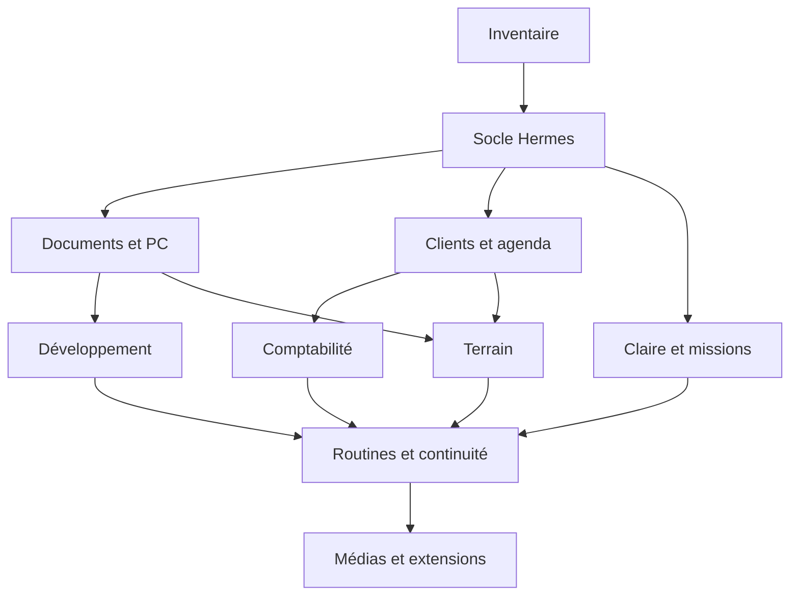

# 18 — Plan de réalisation, dépendances et backlog

## Organisation par lots

Les lots couvrent progressivement tous les métiers. Ils ne sont pas des dates promises : la durée dépend des accès, de l'existant et des recettes. L0 est un inventaire factuel ; il ne doit pas devenir un prétexte pour réécrire l'ensemble de la base avant le premier résultat utile.

| Lot | Objet | Dépendances | Sortie vérifiable |
|---|---|---|---|
| L0 | Inventaire et rapprochement de l'existant | Accès de lecture disponibles | Machines, comptes, code et écarts documentés |
| L1 | Hermes permanent et registre minimal | L0, hôte choisi | Mission simple survivant à une reconnexion |
| L2 | NAS, PC et recherche documentaire | L1, réseau privé | Recherche sourcée et job local contrôlé |
| L3 | Clients, agenda et communications | L1, comptes choisis | Demande reliée à un rendez-vous unique |
| L4 | Claire reliée aux missions | L1, lecture de la base Claire | Action vocale et résultat métier vérifié |
| L5 | Devis et facturation Abby | L3, catalogue et connexion Abby | Parcours fictif puis pilote autorisé |
| L6 | Développement et livraison multiclients | L1/L2, dépôts et hébergements | Mission de code avec prévisualisation et preuve |
| L7 | Terrain, réseau et assistance | L2/L3, capacités ciblées | Diagnostic et compte rendu reliés au projet |
| L8 | Routines, budget et continuité | Lots pilotes stables | Tableau quotidien, reprise et coût par mission |
| L9 | Médias, formation et extensions | L6/L8, fournisseurs vérifiés | Chaîne métier spécialisée recettée |

## L0 — Inventaire

Tâches : relever machine courante ; identifier dépôts, branches et déploiements ; lire les composants Claire réellement actifs ; inventorier NAS, partages, architecture et RAM ; préciser l'agenda et la messagerie ; établir l'état Abby et la migration ; vérifier les connexions déjà autorisées et disponibles ; créer le registre d'écarts.

Sortie : inventaire privé rempli, source par constat, liste des paramètres manquants et proposition de premier pilote. Recette : aucune ressource n'est déclarée active uniquement sur la base de son nom ou d'une ancienne discussion.

## L1 — Socle permanent

Installer la version retenue de Hermes, configurer le fournisseur IA, tester une conversation, mettre en place un service persistant, un registre de missions et les sauvegardes initiales. Le choix d'une API native ou d'un adaptateur est documenté. Une mission de test crée un artefact local et son compte rendu, puis est retrouvée après relancement.

Critère de sortie : identité de l'agent stable, journal, reprise, arrêt propre et récupération du résultat. Aucun navigateur public n'accède au service administratif brut.

## L2 — Documents et PC

Raccorder la liaison privée, vérifier le NAS sans PC, configurer un espace de travail et un corpus témoin, indexer quelques documents représentatifs, tester recherche et changements. Installer le relais Windows pour des capacités de fichier/test bornées. Le contrôle du bureau reste un sous-lot à part.

Critère de sortie : document exact avec provenance, refus d'un autre espace, mise à jour après modification, état clair PC/NAS indisponible. L'indexation complète démarre seulement après le lot témoin et une mesure de charge.

## L3 — Relation client

Créer les objets client/projet/opportunité, choisir l'agenda maître, implémenter propositions et réservation avec déduplication, relire les événements et préparer les communications. Les canaux d'envoi réels sont configurés selon les mandats de Didier.

Critère de sortie : une demande synthétique produit un rendez-vous unique avec un ID réel dans l'environnement de test ou pilote choisi.

## L4 — Claire

Auditer la base et préserver les visuels validés. Ajouter une capacité métier simple et un résultat asynchrone. Tester modes public/client/privé, interruption, expiration et retour d'état. Établir si le transport actuel permet l'appel d'outils requis ; un prototype isolé résout ce point avant toute migration.

Critère de sortie : Claire explique une prestation, prépare une demande, suit une mission et décrit son résultat exact ; une session publique ne peut pas consulter un dossier privé.

## L5 — Abby

Découvrir les outils autorisés, lire le catalogue et les clients, préparer un devis fictif, vérifier les montants, tester la finalisation dans le périmètre approprié et relire le document. Construire le rapprochement et la gestion des reprises. Puis traiter dépenses, imports et états préparatoires selon les capacités réellement disponibles.

Critère de sortie : pas de doublon, état exact, références externes et pièces conservées. Les scénarios engageants ne sont exercés que dans un contexte approprié au test ou explicitement autorisé.

## L6 — Développement

Définir la fiche projet et le modèle de mission, attribuer une branche à l'exécuteur, lancer les tests utiles, produire la prévisualisation et le rapport. Raccorder le catalogue de sites/applications et les contrats de maintenance. Préserver les règles propres à chaque dépôt.

Critère de sortie : modification demandée, version identifiable, recette utilisateur et marche arrière. Une mise à jour de modèle n'altère pas un autre client.

## L7 — Terrain

Inventorier un équipement de laboratoire, exposer un diagnostic, enregistrer mesures et compte rendu, puis relier les lignes de prestation et le rendez-vous. Étendre équipement par équipement selon les interfaces et permissions.

Critère de sortie : preuve avant/après et cible correcte, avec comportement prévu si l'équipement est absent.

## L8/L9 — Généralisation

Mesurer coût et temps ; activer les routines stables ; tester restauration complète ; produire la vue de pilotage ; étendre les procédures aux médias, à la formation et aux projets connexes. Les fonctions domotiques, de montage ou de contrôle visuel sont des pilotes indépendants avec une recette matérielle/fournisseur.

## Backlog priorisé

Priorité P0 : identité, inventaire, mémoire unique, mission persistante, preuve, déduplication, sauvegarde et isolation des clients. P1 : recherche documentaire utile, agenda, devis, Claire métier et livraison de code. P2 : index enrichi, suivi financier étendu, automatisation terrain et routines multiclients. P3 : médias avancés et extensions de Claire.

Le backlog détaillé est dans l'annexe exigences. Chaque tâche doit avoir un ID, un lot, un critère et une preuve. Les inconnues techniques sont traitées par des prototypes courts avec décision de poursuivre ou d'adapter, pas par des promesses de compatibilité.

## Conditions de passage

Un lot peut être partiellement livré si ses sous-ensembles sont indépendants et clairement étiquetés. Une fonction non testée ne passe pas à « terminé ». Les autorisations permanentes sont réutilisées ; les décisions restantes portent sur un résultat concret et préparé. Le rapport de fin de lot explique les résultats, coûts, limites et prochaines actions.
